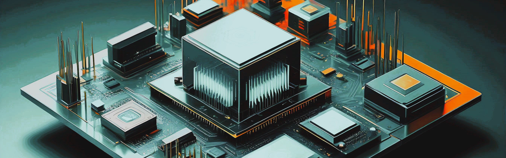

# QAL

Quantum Application development and use-case evaluation for organizations with computational challenges in opimization, simulations and machine learning 

💎 [qalcore](https://github.com/quantumapplicationlab/qalcore) The generic reusable library of quantum routines developped and maintained by the Quantum Application Lab

----------------------------------------------------

🎯 [vqls-prototype](https://github.com/quantumapplicationlab/vqls-prototype) Variational quantum Linear solver routine for qiskit

🎢 [qubols](https://github.com/quantumapplicationlab/qubols) QUBO Linear Solver using D'Wave toolkit

🎰 [qubops](https://github.com/quantumapplicationlab/qubops) QUBO Polynomial Solver using D'Wave toolkit

🚀[HHL-prototype](https://github.com/quantumapplicationlab/hhl-prototype) HHL Linear solver

----------------------------------------------------

⚗️[QC2NL](https://github.com/qc2nl) Quantum Computing for Quantum Chemistry developped by QAL, SURF and the VU

📡 [QuantumRadioAstronomy](https://github.com/QuantumRadioAstronomy) Quantum Computing for radio astronomy pipelines developed by QAL and ASTRON

🚿 [wntr-quantum](https://github.com/quantumapplicationlab/wntr-quantum) Quantum Computing for Water Network Simulations 

------------------------------------------------------

More info : [quantumapplicationlab.com](https://quantumapplicationlab.com/)
